# DSC Phase One Project

Student name: Moses Kigo

Student pace: part time

Scheduled project review date/time: November 2023

Instructor name: Everlyn Asiko

Blog post URL: moseswanja.blogspot.com/2023/11/student-pre-line-height-125-td.html

## Project Overview

For this project, we will use exploratory data analysis to generate insights for a business stakeholder.

## Business Problem
Microsoft sees all the big companies creating original video content and they want to get in on the fun. They have decided to create a new movie studio, but they do not know anything about creating movies. We will explore what types of films are currently doing the best at the box office. The findings will be translated into actionable insights that the head of Microsoft's new movie studio can use to help decide what type of films to create.

## Background
Since the early 1900s, when specialized cinema theaters first appeared, motion pictures have been an integral part of contemporary culture. It is anticipated that box office receipts worldwide would rise rapidly in the upcoming years.
Making a movie is a difficult process with many steps and obstacles. The cost of production is high up front, and there is a significant wait before any returns appear. Consequently, making a movie is a dangerous endeavor because it is difficult to predict whether a film will be financially successful or not. This is particularly problematic for high-end films because there's a lot of money on the line.
There are five significant phases in the making of a movie:

• Development
This phase involves deciding on a movie concept, obtaining the required rights, writing the screenplay, and securing funding.

• Pre-production
Prior to filming, preparations are undertaken by recruiting the actors and crew, finding suitable locations for the shoot, and building the sets and props that will be needed.

• Production
the actual filming of the picture, during which extra sound and raw footage are recorded.

• Post-production
The finished output is created by editing recorded video and audio, adding graphic effects, and adding music.

• Distribution
The film is then promoted, released, and shown in theaters or on other media.

With Microsoft hoping to become a new player in the market, a few major studios are fighting for the interest of the public.

The increase of movie sequels, remakes, and adaptations in today's film industry, which are safer investments because they already have an established following, may be explained by the risk involved in making blockbusters. Aside from creating sequels, there are other alternative financial choices at the various stages of production.

Which genre of screenplay should have its rights purchased?

What is the competition, their investment and ROI?

What time is the best to release the film?

In what way ought the film to be released?

This project aims to equip Microsoft's new movie studio with the knowledge and insights needed to make informed decisions in the competitive and dynamic film industry, utilizing data from various sources and ensuring the creation of successful and engaging films that resonate with audiences.

## The Data
I have Used the three movie datasets below, The datasets contain movie ratings, genres, gross earnings, production years and number votes. In the folder zippedData are movie datasets from:

bom.movie_gross - from Box Office Mojo by IMDBPro, an American website that tracks box-office revenue in a systematic, algorithmic way.

imdb.title.basics, imdb.title.ratings, and tn.movie_budgets - From IMDB, an online database containing information and statistics about movies, TV shows and video games as well as actors, directors and other film industry professionals.

tmdb.movies - from  popular, user editable database for movies and TV shows.

# Data Pre-Analysis and Cleanup

This involved checking for missing data and duplications, correcting datatypes, dropping unnecessary columns and rows, and replacing missing values with specified values

#Merging DataFrames

This involved inner join merges with the required DataFrames and conducting analysis to clean up the new merged DataFrames and prepare for Data Modelling

# Data Modelling

## Popular Genre Combinations

    

    

The heatmap above is a genre co-occurrence matrix, which shows how often each pair of genres appears together in the same movie. The color of each cell represents the number of times the corresponding genres co-occur, with darker colors indicating higher co-occurrence.

From the heatmap, we can observe that certain genres tend to co-occur more frequently. For example, 'Adventure' and 'Action', 'Adventure' and 'Fantasy', 'Adventure' and 'Science Fiction' are some pairs of genres that often appear together.

---

## Most Popular Genres

    
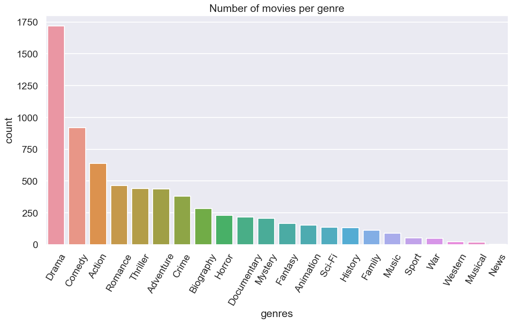
    

## Release period vs worldwide gross

    

    

Movies released in the months of May, June, and July tend to yield higher profits, which coincides with long summer holidays for the northern hemisphere. There is also a noticeable peak in November due to the winter holiday season.
***

    
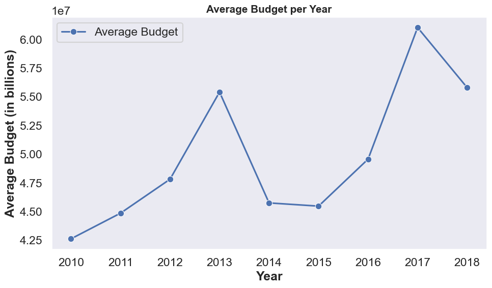
    

Average worldwide gross per year

    

Average Releases per year

    

    

## Return on Investment

This will analyze if there is a relationship between the production budget and the worldwide gross. The analysis will be limited since there are more costs involved in the process after production such as the marketing budget, and residuals which are yments are calculated on the basis of sales performance using rules that are set out in industry negotiated agreements.

Distribution of ROI for Different Budget Ranges

    
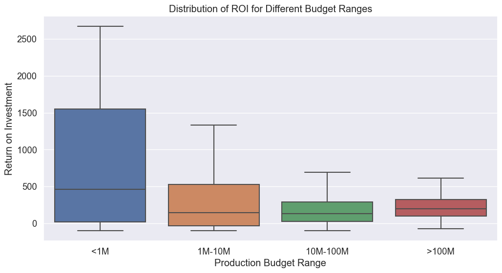
    

Top 5 genres with colors using Seaborn

    
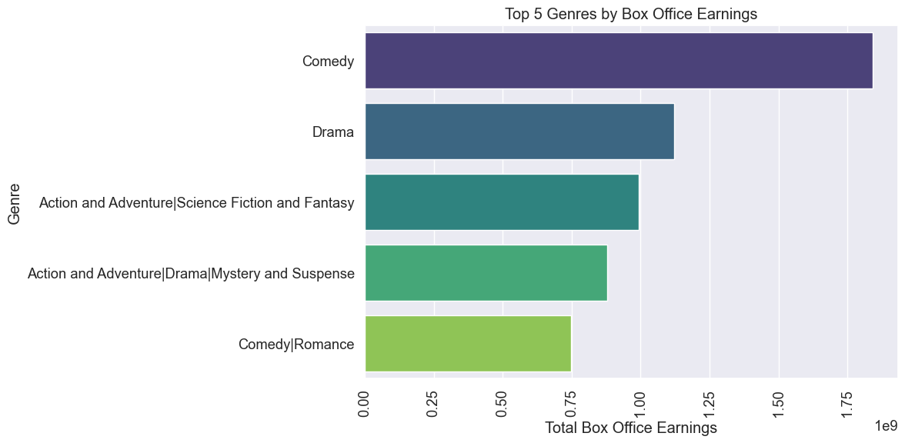
    

Highest earning movies per year
    
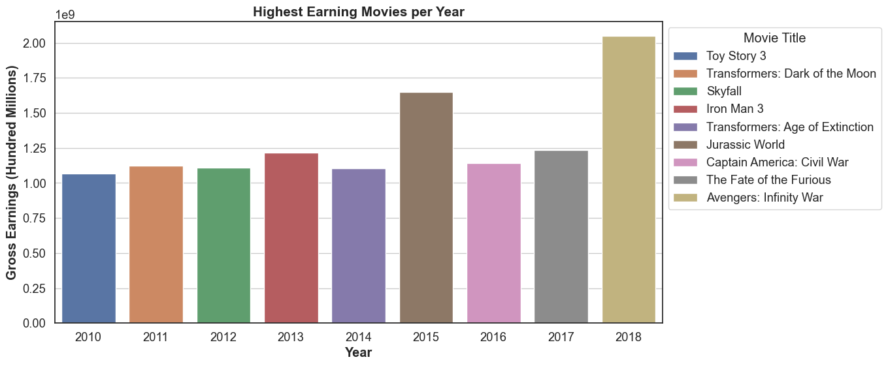
    

Highest gross profit per year

    

    

## Studios: Top 20 Releases Over the Years

We look at the number of movie releases per studio for each year and find that Buena Vista/Walt Disney, Paramount, Universal Studios, Warner Brothers, and Fox are consistently been among the highest number of movie producers over the 8-year period.

Display number of movies per studio each year

Top 20 number of movies per studio each year

    
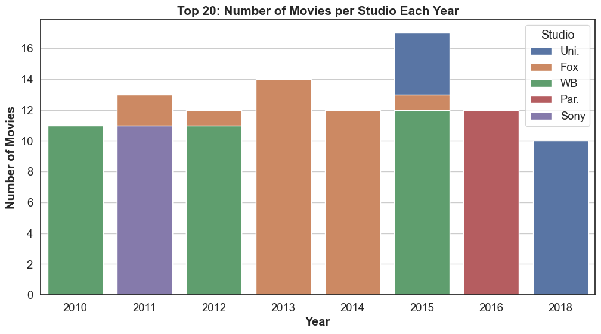
    

## Studios: Highest Earning Per Year

Looking at the highest earners year on year, domestically Walt Disney (BV) and Warner Bros. (WB) appear to have been the most successful with their releases making them the highest earners in 3 out of the 9 years.

Overseas Walt Disney has had even more success with their productions as they have been the highest earning studio for 5 out of the 9 years. Also successful with their production in the foreign market is Universal, being the highest earner in 2 different years.

Looking at global earnings in totality, the data infers that Walt Disney is the most successful production studio between 2010 and 2018 having been the highest earner in 3 different years, followed thereon by Universal Studios.

Studios with the highest domestic gross earnings for each year

    
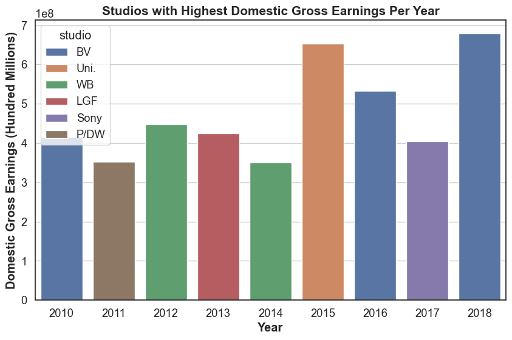
    

Studio with the highest foreign earnings each year

    
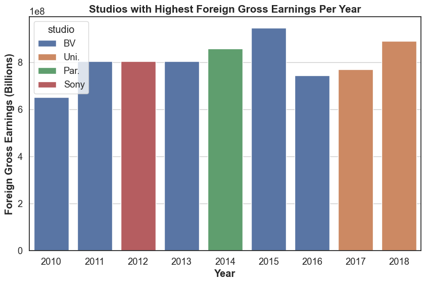
    

Studio with the highest worldwide_gross earnings each year

    
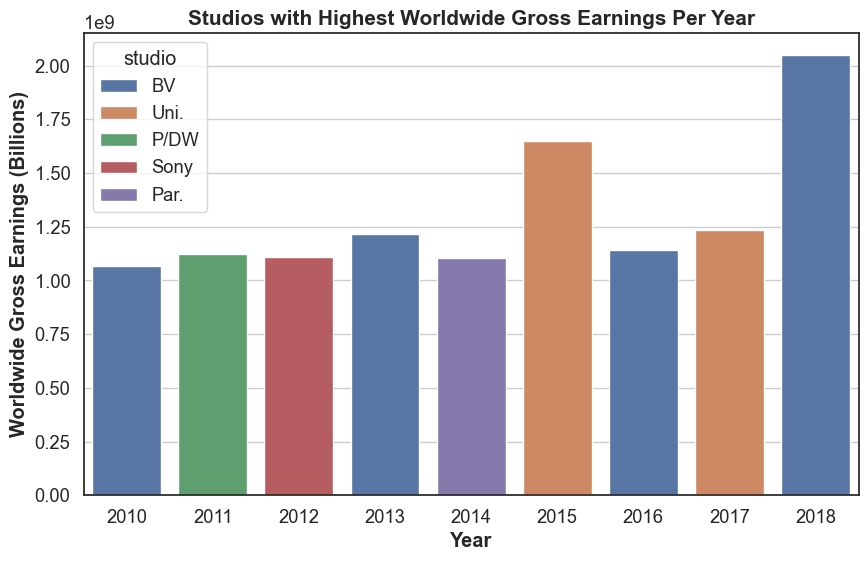
    

## Studios: Distribution of Earnings

The order of the top 10 studios in worldwide earnings follows that of the highest-earning studios domestically. Walt Disney (BV) is consistently the highest earner in all markets. Domestically, Universal Studios is the second highest-earning studio but sits third in the foreign market. The inverse is true for Fox who sits second in earnings overseas but third domestically.

All studios in the top 10 earned above USD 1 billion.

    
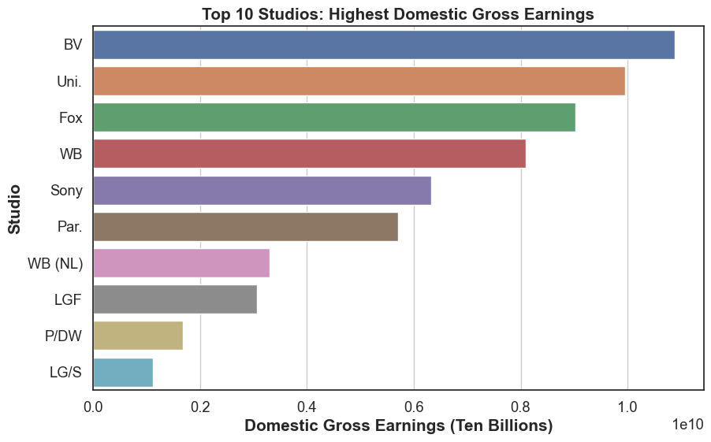
    

Highest foreign earning studios

Top 10 studios with the highest foreign earnings

    
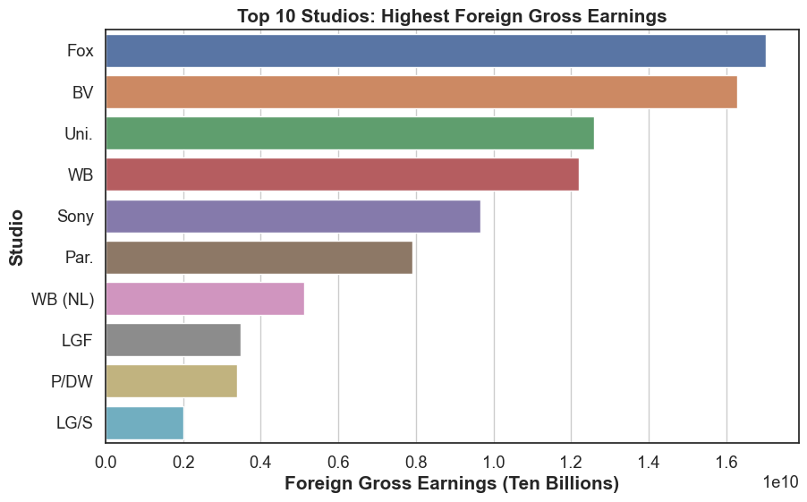
    

Highest worldwide earning studios

    
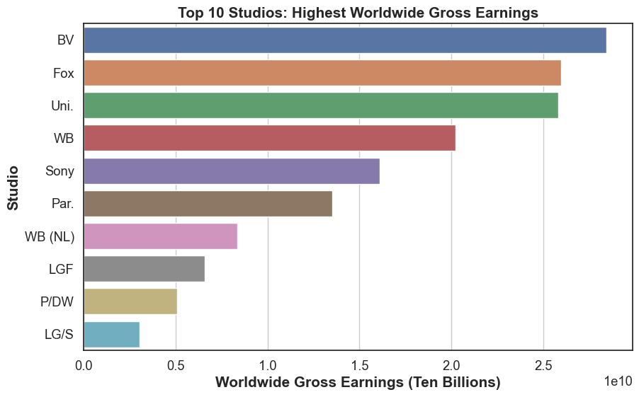
    

Top 20 studios with the highest gross_profit

    
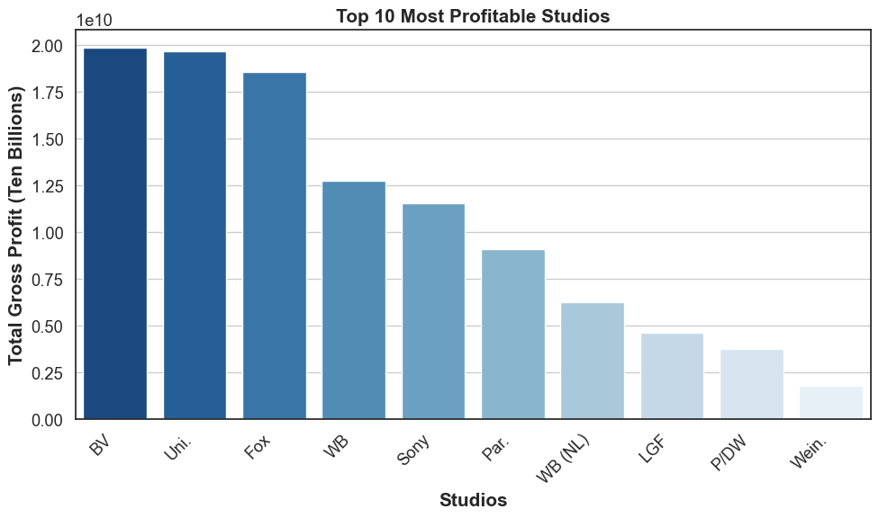
    

## Studios: Top 20 Most Profitable Releases

Out of the top 20 gross worldwide earning movies, 17 are the most proitable. 65% of the most profitable movies are sequels.

    
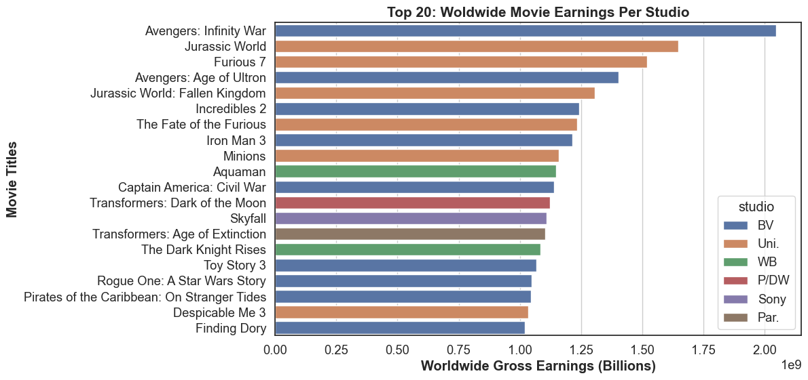
    

Studios with the top 20 most profitable movie releases

    
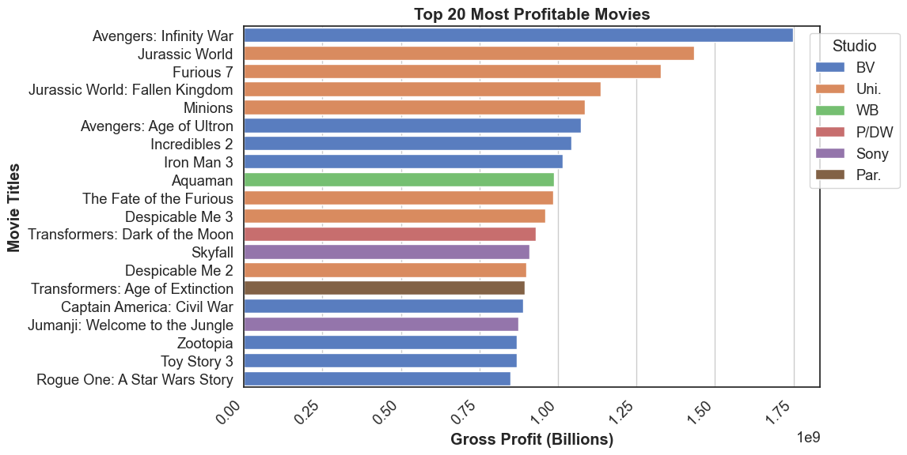
    

Find the number of movies both in top20_worldwide_earners and top20_profitable_movies

Number of movies in both top20_worldwide_earners and top_20_profitable_movies: 17
    

## Production Budget: Average Budget per Studio

On average Paramount DreamWorks (P/DW) allocated the highest budget towards their projects. While they have not been the top highest-earning or most profitable studio they have been consistently in the top 10.

Walt Disney, the highest and most profitable studio within the period on average allocates the second highest budget towards its projects, followed thereon by WB and Fox who have also consistently been among the highest earners and the most profitable.

# Average production budget per studio

    
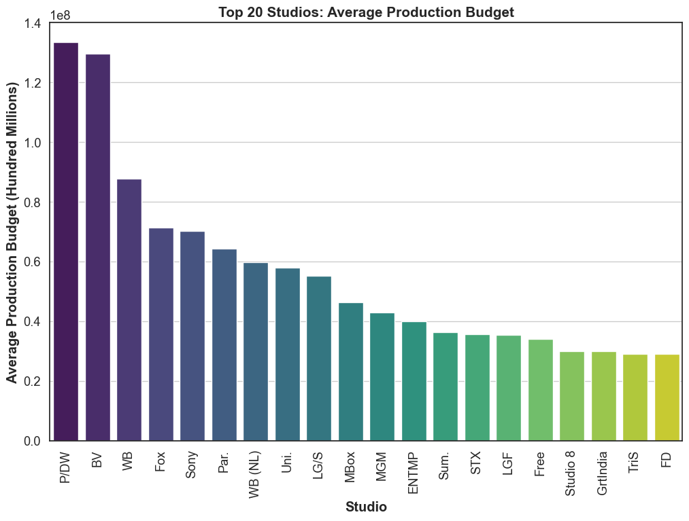
    

## Production Budget: Top 20 Studios with the Highest Budgets

Walt Disney, being the highest-earning studio and the most profitable is also the studio with the highest budget. We observe that the top 20 most profitable studios are also the same top 2 studios with the highest budget in the same order.

Studios with the highest production budgets

   
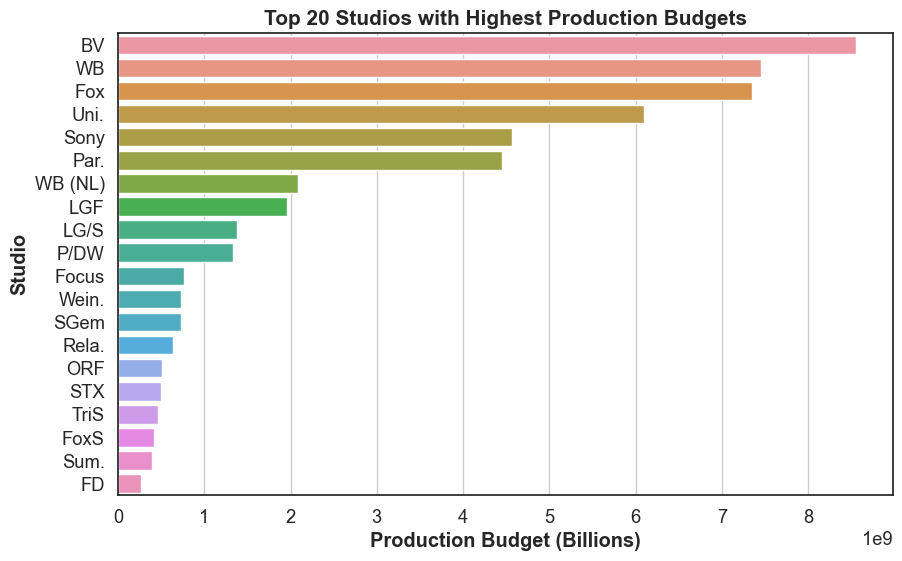  

Number of studios in with the highest profit which are also the most profitable

Number of studios in top20_studios_budgets that are also in top20_studios_profit: 10
    

## Production Budget: Movies with the Largest Budget

Only 4 of the movies with the highest production budget are among the top 20 most profitable movies out of which 3 are produced by Walt Disney and the other by Universal Studios.

From the top 20 movies with the largest production budgets, Walt Disney's movies make up 45%, followed thereafter by Warner Bros. productions at 20%, Warner Bros. Netherlands at 15% and the other spots occupied by Sony and Universal Studio's movies.

##Top 20 movies with the largest production budgets

    
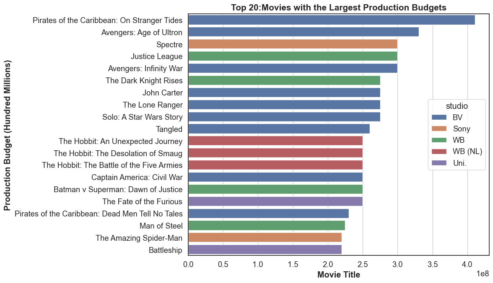
    

## Gross Profit & Production Budget

The data infers that the average gross profit earned increases within budget.

We observe that movies in the low-budget category have brought in the lowest aggregate gross profit, followed thereon by the medium and high-budget categories. The high-budget category on average has earned over 3 times the gross profit that the low-budget category has earned.

The very high budget category far surpasses the rest in earnings as movies within this category on average bring in over USD 22.5 million above the high budget category. Over and above the budget various other factors would result in such blockbuster films earning enormous profits which include the storyline, actors, and marketing, among others.

### Categorize the movies into budget categories

    
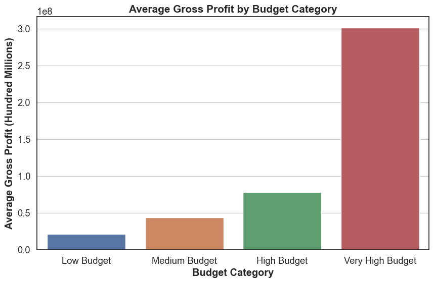
    

## Analyzing Sequels

### Find Similar Movie Titles

['Star Trek Into Darkness', 'Star Trek Beyond', 'Spectre', 'Shrek Forever After', 'True Grit']
    

### Comparing the Gross Profit

All sequel releases are very profitable and are a great way for studios to earn profits by further developing existing productions. The performance between earlier and later releases varies from movie to movie. The contributors to why this may be difficult to determine from the data available but may be attributable to the success of the preceding movie, script, and marketing.

    
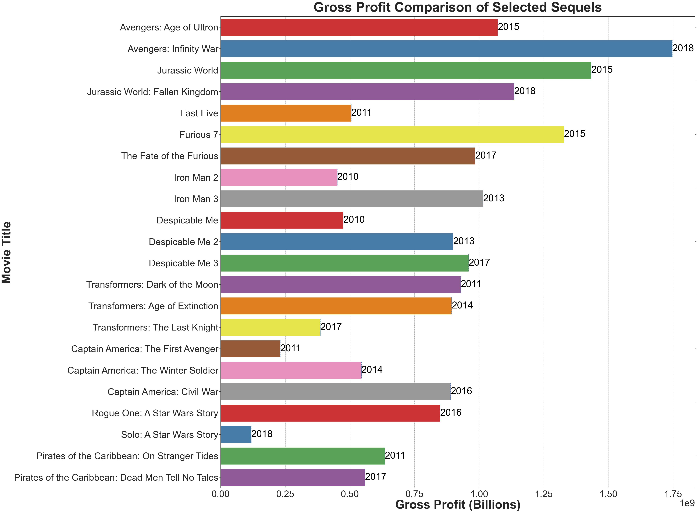
    

## Conclusions

The movie industry is highly lucrative, earning the major studios hundreds of millions of dollars in profit. Despite the downward trend in the number of movie releases, the future of the industry remains promising as earnings continue to skyrocket.

The industry is currently dominated by 10 major studios whose movies are consistently among the highest-earning and most profitable. A portion of the success of these studios can be attributed to their ability to turn already existing material such as previous movies, comic books and Booka into franchise films as well as make multiple sequels from their original creations enabling them to squeeze every last drop in earnings from those storylines.

The leading studios in the industry have done their homework, majorly focusing their productions of the most lucrative genres, Action, Adventure, Sci-Fi, Animation, and Comedy - a recipe for success. Additionally putting major focus on sequels and franchise productions enabling to capitalize on the development of one storyline and character development to keep movie goers in their seats.

The international market is critical for the success of any major film studio and thus must not be neglected.

The impact of the Covid-19 pandemic through 2020 and 2021 was that numerous films have had their theatrical releases canceled worldwide, resulting in an alternative announcement pattern with delayed releases. In the US film industry, more than 155 films were delayed to 2020 and produced in 2021 or 2022.

Across the world, and to varying degrees, cinemas and movie theaters were closed, festivals were cancelled or postponed, and film releases were moved to future dates or delayed indefinitely. Due to cinemas and movie theaters closing, the global box office dropped by billions of dollars, streaming saw a significant increase in popularity, and the stock of film exhibitors dropped dramatically. This in turn created openings for independent cinema productions to receive wider exposure.

## Business Recommendations

1. Alternative investment options: It may be a feasible alternative for Microsoft to invest in one of the more successful studios in the business because it is significantly less risky and guarantees Microsoft a fair return on investment. Considering potential partnerships, marketing strategies, and distribution channels to ensure film and financial success.

2. Create Long-Lasting Storylines: Franchise films such as comic book adaptations, sci-fi, and fantasy films have become increasingly profitable over the years and have contributed significantly to the success of other major studios.

3. Industry and Competitor Analysis: Given the dominance of major studios like Walt Disney, Universal Studios, Warner Bros., Sony, and Fox, a thorough analysis of the industry and competitors is important. Their sustained success serves as a reminder of how difficult it is to compete in the market.

4. International Market Focus: The success of large studios like Disney has been influenced by the international market. Success can be increased overall by considering global audiences and creating material that suits their tastes.

5. Create film genres, themes, and formats that align with market demand and audience preferences. By buying rights to popular book titles, introducing international stories, remaking great foreign films, and tapping into otherwise unexplored cultures like African, Arab, and indeginous/first people stories.

6. Audience Segmentation: Segment the movie-going audience based on demographics, psychographics, and viewing habits. Understand the unique preferences and demands of different audience segments. Explore potential synergies between Microsoft's existing customer base and film preferences.

## Recommendations for Future Analysis

1. Demographic Trends in Film Preferences:
Explore how age, gender, and geographic location influence audience preferences for film genres, themes, and content. This analysis can help in tailoring marketing strategies and content creation.

2. Economic Factors and Box Office Performance:
Investigate how economic indicators such as GDP, inflation, and consumer spending impact box office performance. Understanding the economic context can assist in releasing timing and pricing strategies.

3. Influence of Awards and Critical Acclaim:
Analyze the relationship between film awards (e.g., Oscars, Cannes) and a film's box office success. Determine if critical acclaim and awards influence audience choices.

4. Impact of Directors and Filmmakers:
Investigate how the reputation and record of directors, producers, and writers affect a film's success. Identify which filmmakers have a strong influence on box office performance.

5. Marketing and Promotion Strategies:
Analyze the correlation between marketing budgets, promotional strategies, and a film's box office success. Determine the most effective marketing tactics.

6. Impact of social media and Online Communities:
Examine the influence of social media platforms and online film communities on a film's success. Analyze the relationship between social media engagement and box office performance.

7. Technology and Production Quality:
Investigate how advancements in technology, such as special effects and production quality, contribute to a film's success. Determine audience expectations regarding production value.

8. Adoption of Sustainable Practices in Filmmaking:
Explore how the adoption of environmentally friendly and sustainable practices in film production impacts audience perception and success, especially in the era of increasing environmental awareness.

9. Streaming Service Original Content Strategy:
Analyze the strategies employed by streaming services in creating and promoting original content. Understand how these strategies compare to traditional studio production.

